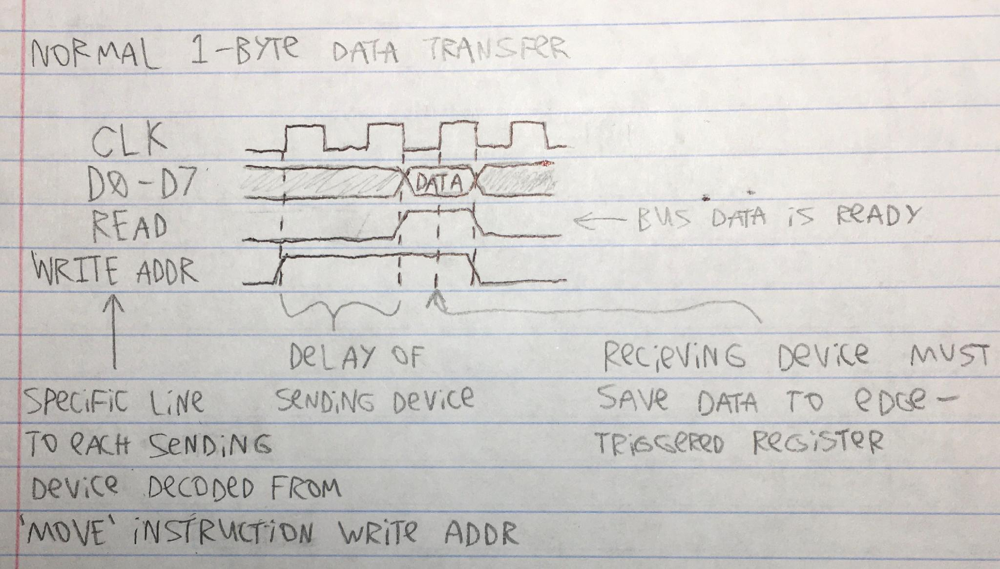

# Overview

This will be an 8-bit stack-based computer processor based off of Reverse Polish Notation (RPN). The whole computer has a LIFO (Last In First Out) single stack which stores individual bytes. Memory pointers will be 16 bits. There will be another piece of memory that will be sort of like the heap and can be written to and read from without hardware protection.
I got the idea for this from my 1989 HP 48SX calculator which also uses RPN.

# Program instructions

Each instruction will be 16 bits and interpreted by the control unit. The first 4 bits (0 - 3) of the instruction will address the below list of operations. The rest of the instruction (bits 4 - 15) may be ignored or used for different things depending on the specific operation.

Here's the current list of the operation codes (opcodes):

0. `MOVE` - Bus usage - The rest of the instruction will be interpreted as follows: bits 8 - 11 address the device which will set the state of the bus and bits 12 - 15 will address the device to read from it. Bits 4 - 7 are sent to the ALU as it's opcode incase the data is comming from it.
1. `WRITE` - Similar to `MOVE` exept writes instruction bits 4 - 11 to the bus. Bits 12 - 15 address the device to read from it. To push a byte to the stack, use `WRITE 0x42 STACK`.
2. `GOTO` - Saves the 2 execution pointer GOTO latches (each of them are 1 byte) to the execution pointer
3. `GOTO-IF` - Reads the LSB of the value in the goto decider latch and does a GOTO only if it is 1, otherwise does nothing
4. `HALT` - Stops the clock, usefull for debugging
5. `CALL` - Effectively the same as `GOTO` but creates a new stack frame by pushing the return address and stack frame pointer onto the call stack. The stack frame pointer will be calculated as `ToS - (NArgs - 1)` where `ToS` is the current top-of-stack pointer, and `NArgs` is the number of arguments passed to the function on the stack (bits 4 - 11 of this instruction). This calculation will ensure that the bottum of the newly called function's stack frame will be at the first of its arguments.
6. `RETURN` - The program counter will be set to bits 16 - 31 of the 32-bit word poped off the call stack (this is the return address). The stack-frame pointer will be ignored as it is no longer needed.
7. `READ-VAR` - Reads from the stack at the current stack frame pointer + bits 4 - 11 of this instruction. Bits 12 - 15 address device to read the bus.
8. `WRITE-VAR` - Similar to `READ-VAR` except writes to stack. Bits 8 - 11 address device to write to the bus, bits 4 - 7 & 12 - 15 are the variable offset.

# Bus

Up to 15 devices can read the bus and 16 write to it.
Devices that can read the bus:

0. `NONE` - Nothing reads this so that bytes can be poped from the stack without them going anywhere.
1. `STACK` - Stack controller (Push)
2. `ALU-A` - ALU latch A
3. `ALU-B` - ALU latch B
4. `GOTO-A` - Control unit - Execution pointer GOTO latch A (first byte)
5. `GOTO-B` - Control unit - Execution pointer GOTO latch B (second byte)
6. `GOTO-DECIDER` - Control unit - GOTO decider latch (For GOTO-IF)
7. `GPRAM` - GPRAM - Write
8. `GPRAM-INC-ADDR` - GPRAM - Write (++ address)
9. `GPRAM-ADDR-A` - GPRAM - Address latch A
10. `GPRAM-ADDR-B` - GPRAM - Address latch B
11. `GPIO-WRITE` - Writes to GPIO output pins
12. Replaces value at current stack frame pointer + given variable offset. Used by the `WRITE-VAR` instruction.

Devices that can set the state of (write to) the bus:

0. `STACK-NO-POP` - Stack controller (Don't pop)
1. `STACK-POP` - Stack controller (pop)
2. `ALU` - ALU output
3. Control unit instruction bits 4 - 11, used for the `WRITE` instruction
4. `GPRAM` - GPRAM - Read
5. `GPRAM-INC-ADDR` - GPRAM - Read (++ address)
6. `GPRAM-ADDR-A` - GPRAM - Address bits 0 - 7
7. `GPRAM-ADDR-B` - GPRAM - Address bits 8 - 15
8. `GPIO-READ` - Reads GPIO input pins
9. Reads value at current stack frame pointer + given variable offset. Used by the `READ-VAR` instruction.

First iteration of how the bus timing will work
</img>

# The Stack

The stack will simply be a piece of memory seperate from the program memory and managed by hardware.

There will be two ways to access the stack:

1. Push, Read (No-pop), and Read (Pop)
2. Using the current stack frame pointer + variable offset

## Stack variable offset

The stack variable offset will be an 8-bit number added to the current stack-frame pointer. It will be sent by the control unit during both `READ-VAR` and `WRITE-VAR` instructions.

# Call stack & stack frames

Whenever a "function" is called (using the `CALL` instruction), the first bytes on the stack are the function's parameters. After that it's whatever local variables/operands that the function uses. To keep track of where a function's stack frame begins, there will be a seperate stack memory (the Call Stack) containing 256 (1 byte address size) 32-bit words. The 1st 16 bits of each call stack word will be the pointer to the start of each corresppnding stack frame, the 2nd 16 bits will be the return address - where to set the program counter during a `RETURN` instruction.

# ALU

The ALU uses 2 8-bit latches for input and has 1 output. The specific operation it does is controlled by 4 bits (2^4 = 16 operations). All operations that result in a boolean output all `0`s except for the result which is the LSB.

0. `ADD` - Add
1. `SUB` - Subtract
2. `MULT` - Multiply
3. `NOT` - Bitwise NOT (latch A)
4. `OR` - Bitwise OR
5. `AND` - Bitwise AND
6. `XOR` - Botwise XOR
7. `SHIFT-L` - Bitshift Left (latch A)
8. `SHIFT-R` - Bitshift Right (latch A)
9. `ADD-OVERFLOW` - Whether adding will overflow
10. `EQ` - Whether bytes are equal
11. `BOOL-EQ` - Whether the LSBs are equal
12. `GREATER-THEN` - Whether A > B
13. `A` - Contents of A latch
14. `B` - Contents of B latch
15. `ADD-WITH-CARRY` - Add with incomming carry bit set to 1

# Flow Control

In the actual machine code there are no such things as functions, loops, if-statements, etc. Instead, these will be converted by the compiler into instructions which explicitly set the program execution pointer.

## GOTO and GOTO-IF

A goto will first need to use the bus usage instruction (Instruction 0) twice to set both of the execution pointer A and B goto latches, probably comming from the stack. This is for returning from a function using the return address, but if calling a function, the compiler can just `WRITE` the hardcoded values directly to the A and B latches. Then the GOTO instruction will be used which uses the A and B goto latches to set the execution pointer.

GOTO-IF: First, move a value into the control unit GOTO decider latch, then use the GOTO-IF instruction. This will do the same as the GOTO instruction described above ONLY if the LSB of the latch is 1.

## Function calling

Functions in the machine code are only defined by `CALL` and `RETURN` instructions. To call a function, make sure the correct pointer to the beginning of the function is stored in the control unit goto A and B lathes. Then use the `CALL` instruction with the number of arguments to be passed to the function which will

# I/O

There will be 8 input and 8 seperate output pins.

# General purpose static-RAM (GPRAM)

This piece of memory will not have any hardware protection like the stack and can be writen to and read from at any location. It will have a 16-bit address by 8-bit word size (65,536 bytes) just like the stack.

It's address latch can be optionally incremented upon reads/writes and can be directly set by 2 8-bit latches (`GPRAM-ADDR-A` and `GPRAM-ADDR-B`) from the bus. If the address is incremented, the read/write will happen first, then the incrementation.