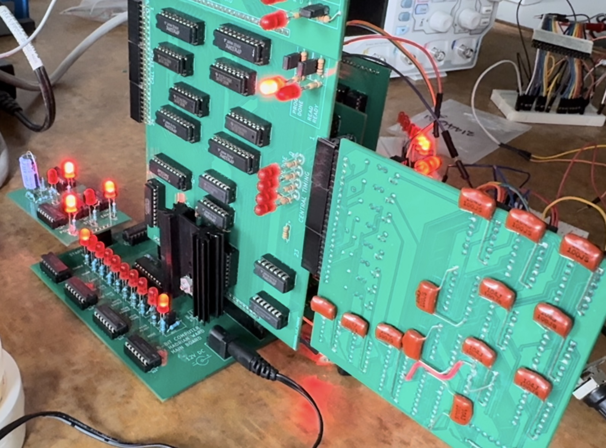
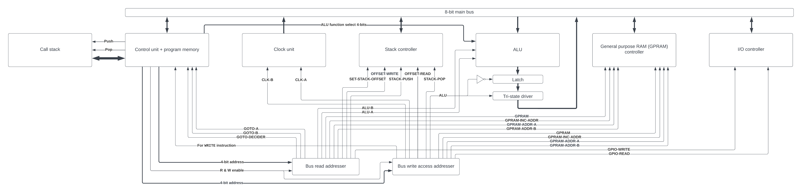

# Overview

This is the design and specifications for an 8-bit stack-based computer processor designed to support programming in Reverse Polish Notation (RPN). The computer has a LIFO (Last In First Out) stack which stores individual bytes. The Top of Stack (ToS) will be a 16-bit pointer which can be incremented and decremented for Pushes and Pops. It will also be possible to read/write the stack below the ToS. There will be another piece of memory, the general purpose static-RAM (GPRAM), that will be sort of like the heap and can be written to and read from without hardware protection.
I got the idea for this from my 1989 HP 48SX calculator which also uses RPN.

</img>
</img>

# Program instructions

Each instruction will be 16 bits and interpreted by the control unit. The first 4 bits (0 - 3) of the instruction will address the below list of operations. The rest of the instruction (bits 4 - 15) may be ignored or used for different things depending on the specific operation.

Here's the current list of the operation codes (opcodes):

0. `MOVE` - Bus usage - The rest of the instruction will be interpreted as follows: bits 8 - 11 address the device which will set the state of the bus and bits 12 - 15 will address the device to read from it. Bits 4 - 7 are sent to the ALU as it's opcode incase the data is comming from it.
1. `WRITE` - Writes instruction bits 4 - 11 to the bus. Bits 12 - 15 address the device to read from it.
2. `GOTO` - Saves the 2 execution pointer GOTO latches (each of them are 1 byte) to the program counter
3. `GOTO-IF` - Reads the LSB of the value in the goto decider latch and does a GOTO only if it is 1, otherwise does nothing
4. `HALT` - Stops the clock, usefull for debugging
5. `CALL` - Effectively the same as `GOTO` but also pushes the return address (current value of program counter) onto the call stack. Note: The return address can be copied as-is and does not need to be incremented because it will be incremented normally after each `RETURN` instruction when it is used.
6. `RETURN` - The program counter will be set to the return address popped off the top of the call stack.

# Bus

Up to 15 devices can read the bus and 16 write to it.
Devices that can read the bus:

0. `NONE` - Nothing reads this so that bytes can be popped from the stack without them going anywhere.
1. `STACK-PUSH` - Stack controller (Push)
2. `ALU-A` - ALU latch A
3. `ALU-B` - ALU latch B
4. `GOTO-A` - Control unit - Program counter GOTO latch A (first byte)
5. `GOTO-B` - Control unit - Program counter GOTO latch B (second byte)
6. `GOTO-DECIDER` - Control unit - GOTO decider latch (For GOTO-IF)
7. `GPRAM` - GPRAM - Write
8. `GPRAM-INC-ADDR` - GPRAM - Write (++ address)
9. `GPRAM-ADDR-A` - GPRAM - Address bits 0 - 7
10. `GPRAM-ADDR-B` - GPRAM - Address bits 8 - 15
11. `GPIO-WRITE-A` - Writes to GPIO output pins 0 - 7
12. `OFFSET-WRITE` - Replaces value in stack at `ToS - offset`
13. `SET-STACK-OFFSET` - Sets the stack offset byte
14. `ALU-C-IN` - ALU latch for carry and borrow
15. `GPIO-WRITE-B` - Writes to GPIO output pins 8 - 15

Devices that can set the state of (write to) the bus:

0. `STACK-POP` - Stack controller (pop)
1. `OFFSET-READ` - Reads value from stack at `ToS - offset`
2. `ALU` - ALU output
3. Control unit instruction bits 4 - 11, used for the `WRITE` instruction
4. `GPRAM` - GPRAM - Read
5. `GPRAM-INC-ADDR` - GPRAM - Read (++ address)
6. `GPRAM-ADDR-A` - GPRAM - Address bits 0 - 7
7. `GPRAM-ADDR-B` - GPRAM - Address bits 8 - 15
8. `GPIO-READ-A` - Reads GPIO input pins 0 - 7
9. `CLK-COUNTER-A` - Lower byte of clock counter
10. `CLK-COUNTER-B` - Upper byte of clock counter
11. `GPIO-READ-B` - Reads GPIO input pins 8 - 15

# The Stack

The stack will simply be a piece of memory seperate from the program memory and managed by hardware.

There will be two ways to access the stack:

1. Push and Pop
2. Using the current ToS pointer - stack offset (`OFFSET-WRITE` and `OFFSET-READ`) (does not change ToS). The stack offset will be a 1-byte number set from the bus (`SET-STACK-OFFSET`) and will not affect pushes and pops.

# Call stack

Whenever a "function" is called (using the `CALL` instruction), the current program counter will be pushed onto the call stack. The call stack will be a seperate stack memory containing 256 (1 byte address size) 16-bit words. Each word will be a return address - where to set the program counter during a `RETURN` instruction.

# ALU

The ALU uses 2 8-bit latches for input and has 1 output. The specific operation it does is controlled by 4 bits (2^4 = 16 operations). All operations that result in a boolean output all `0`s except for the result which is the LSB.

0. `ADD` - Add
1. `ADD-C` - Addition carry
2. `NOT` - Bitwise NOT (latch A)
3. `OR` - Bitwise OR
4. `AND` - Bitwise AND
5. `XNOR` - Bitwise XNOR, whether each pair of bits are equal
6. `SHIFT` - Bitshifts A left by the first 3 bits of B
7. `EQ` - Whether bytes are equal
8. `A` - Contents of A latch
9. `B` - Contents of B latch
10. `EXT-10` - Extension (not implemented)
11. `EXT-11` - Extension (not implemented)
12. `EXT-12` - Extension (not implemented)
13. `EXT-13` - Extension (not implemented)
14. `EXT-14` - Extension (not implemented)
15. `EXT-15` - Extension (not implemented)

# Flow Control

In the actual machine code there are no such things as functions, loops, if-statements, etc. Instead, these will be converted by the compiler into instructions which explicitly set the program execution pointer.

## GOTO and GOTO-IF

A goto will first need to use the bus usage instruction (Instruction 0) twice to set both of the execution pointer A and B goto latches, probably comming from the stack. This is for returning from a function using the return address, but if calling a function, the compiler can just `WRITE` the hardcoded values directly to the A and B latches. Then the GOTO instruction will be used which uses the A and B goto latches to set the execution pointer.

GOTO-IF: First, move a value into the control unit GOTO decider latch, then use the GOTO-IF instruction. This will do the same as the GOTO instruction described above ONLY if the LSB of the latch is 1.

## Function calling

Functions in the machine code are only defined by `CALL` and `RETURN` instructions. To call a function, make sure the correct pointer to the beginning of the function is stored in the control unit goto A and B latches. Then use the `CALL` instruction which is basically a GOTO but will first put the current program counter value onto the call stack as the return address.

# I/O

There will be 8 input and 8 seperate output pins.

# General purpose static-RAM (GPRAM)

This piece of memory will not have any hardware protection like the stack and can be writen to and read from at any location. It will have a 16-bit address by 8-bit word size (65,536 bytes) just like the stack.

It's address latch can be optionally incremented upon reads/writes and can be directly set by 2 8-bit latches (`GPRAM-ADDR-A` and `GPRAM-ADDR-B`) from the bus. If the address is incremented, the read/write will happen first, then the incrementation.