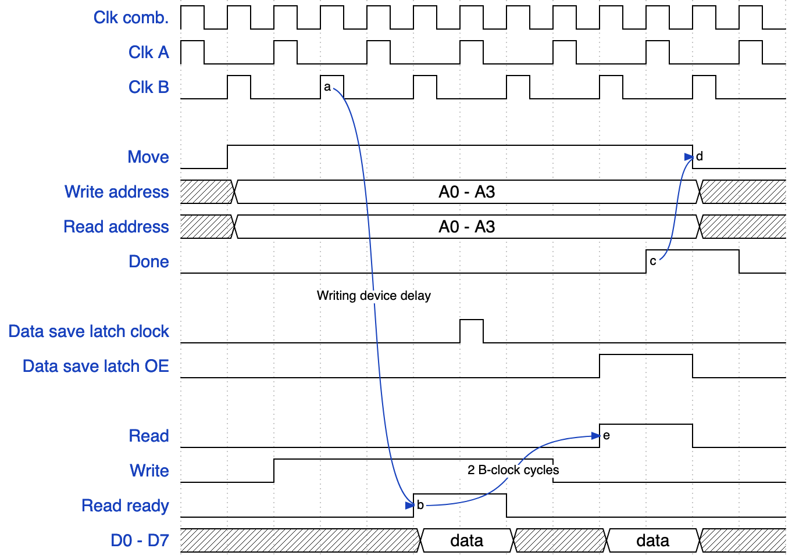

# Timing

There will be 3 clock signals: A, B, and combined (ORed). They can all be described by a 4-part cycle:

| A | B | Combined |
| - | - | - |
| 0 | 0 | 0 |
| 1 | 0 | 1 |
| 0 | 0 | 0 |
| 0 | 1 | 1 |

Various devices in the computer will interact with each other using strictly different clocks (A and B) so as to make it simple to prevent race conditions. Devices' internal logic can be run on the combined clock if necessary to make it faster.

## Call stack

The call stack will use the B clock

## Bus timing

| Line(s) | Controlled by | Clock set | Read by | Clock read |
| - | - | - | - | - |
| Write | Bus arbiter | A | Writing device | B |
| Read | Bus arbiter | B | Reading device | A |
| Read ready | Writing device | B | Bus arbiter | - |
| D0 - D7 | Writing device | B | Reading device | A |

</img>

## Control unit internal timing

All instructions are meant to take the same amount of cycles except for `MOVE` which could take arbitrarily long depending on the sending device.

1. Load & latch instruction into instruction register